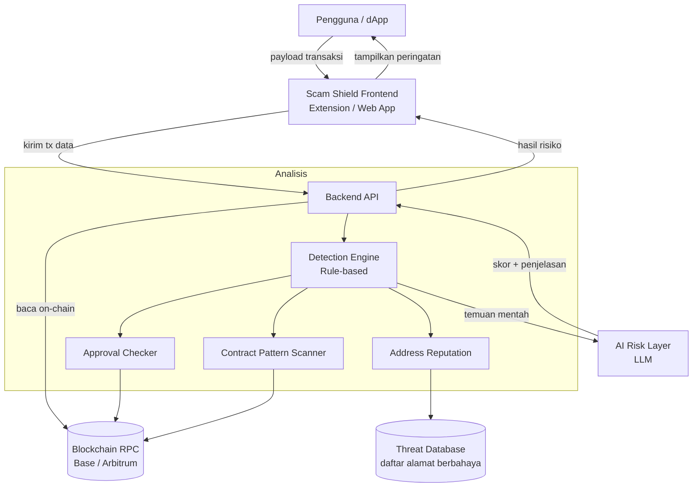

# Scam Shield — PRD & Architecture

**Kategori:** Track 2 — Finance & Commerce
**Tema:** AI × Web3 Security
**Status:** Draft untuk Hackathon (MVP target: 30 September 2026)
**Tim:** Level menengah • Prioritas: pasti selesai tepat waktu

---

## 1. Ringkasan Produk

Scam Shield adalah lapisan keamanan berbasis AI yang muncul **tepat sebelum pengguna menandatangani transaksi Web3**. Sistem menganalisis smart contract, permintaan approval, dan alamat tujuan, lalu menerjemahkan temuan teknis menjadi peringatan risiko berbahasa awam yang mudah dipahami — sehingga pengguna bisa membatalkan transaksi berbahaya sebelum kehilangan dana.

Inti nilainya: **AI membaca hal yang tidak bisa dibaca manusia awam (bytecode, approval, reputasi alamat), blockchain menjadi objek yang diamankan.**

---

## 2. Masalah

Pengguna Web3 kehilangan dana setiap hari karena menandatangani transaksi yang tidak mereka pahami:

- **Unlimited approval** — memberi kontrak akses tak terbatas ke seluruh token mereka.
- **Rug pull / kontrak berbahaya** — berinteraksi dengan kontrak yang dirancang untuk mencuri.
- **Address poisoning / alamat palsu** — mengirim dana ke alamat penipu yang mirip.
- **Phishing dApp** — situs palsu yang meminta tanda tangan berbahaya.

Wallet standar hanya menampilkan data mentah (hex, alamat kontrak) yang tidak berarti bagi pengguna biasa. Tidak ada "penerjemah" yang memberi tahu **"apa yang sebenarnya akan terjadi pada dana saya?"** dengan bahasa manusia.

---

## 3. Tujuan & Bukan Tujuan

### Tujuan (MVP)
- Menganalisis transaksi/kontrak dari sebuah alamat atau payload transaksi.
- Mendeteksi minimal 3 pola risiko utama: unlimited approval, alamat berbahaya, kontrak mencurigakan.
- Menghasilkan skor risiko (Aman / Waspada / Bahaya) + penjelasan bahasa awam.
- Menampilkan peringatan dalam antarmuka sebelum penandatanganan.

### Bukan Tujuan (di luar scope hackathon)
- Memblokir transaksi secara paksa di level wallet (hanya memberi peringatan).
- Mengeksekusi atau membatalkan transaksi otomatis.
- Mendukung semua chain sekaligus (fokus 1 chain EVM dulu).
- Audit smart contract tingkat profesional (kita deteksi pola, bukan formal verification).

---

## 4. Target Pengguna

**Persona utama — "Pengguna Web3 Pemula-Menengah"**
Sudah punya wallet dan bertransaksi, tapi tidak bisa membaca smart contract dan takut ketipu. Butuh "jaring pengaman" yang mengingatkan sebelum terlambat.

**Persona sekunder — "Power user yang hati-hati"**
Berpengalaman tapi ingin double-check cepat sebelum berinteraksi dengan dApp/kontrak baru yang belum dikenal.

---

## 5. Fitur & Prioritas (MoSCoW)

| Fitur | Prioritas | Deskripsi |
|---|---|---|
| Analisis approval berbahaya | **Must** | Deteksi unlimited/berlebihan approval token (ERC-20/721). |
| Cek reputasi alamat | **Must** | Bandingkan alamat tujuan/kontrak dengan daftar alamat berbahaya. |
| Skor risiko + penjelasan AI | **Must** | Ubah temuan teknis jadi label risiko + narasi bahasa awam. |
| Antarmuka peringatan pra-tanda tangan | **Must** | Pop-up/panel yang menampilkan hasil sebelum user menyetujui. |
| Deteksi pola kontrak mencurigakan | **Should** | Cek ciri kontrak berisiko (fungsi tersembunyi, honeypot pattern). |
| Riwayat pemindaian | **Could** | Simpan hasil scan sebelumnya untuk referensi. |
| Dukungan multi-chain | **Won't (MVP)** | Ditunda ke pasca-hackathon. |

---

## 6. Alur Pengguna Utama

1. Pengguna akan menandatangani sebuah transaksi (via dApp atau input manual).
2. Scam Shield menangkap payload transaksi (alamat kontrak, fungsi, parameter, alamat tujuan).
3. **Detection Engine** menjalankan pemeriksaan berbasis aturan (approval, reputasi, pola kontrak).
4. **AI Layer** menerima temuan mentah dan menyusun skor risiko + penjelasan bahasa awam.
5. Antarmuka menampilkan hasil: 🟢 Aman / 🟡 Waspada / 🔴 Bahaya, beserta alasan.
6. Pengguna memutuskan: lanjut atau batal.

---

## 7. Arsitektur Sistem

### Penjelasan Komponen

**Frontend (Extension / Web App).** Titik sentuh pengguna. Menangkap payload transaksi dan menampilkan peringatan sebelum penandatanganan. Untuk MVP, versi paling aman adalah **web app** tempat user menempelkan alamat/tx untuk dipindai; versi lanjutan berupa **browser extension** yang menyela alur signing secara real-time.

**Backend API.** Orkestrator. Menerima data transaksi, memanggil Detection Engine, lalu meneruskan hasilnya ke AI Layer, dan mengembalikan penilaian akhir ke frontend.

**Detection Engine (rule-based).** Otak deterministik. Tiga sub-modul:
- *Approval Checker* — mendeteksi `approve()` dengan nilai tak terbatas atau berlebihan.
- *Address Reputation* — mencocokkan alamat dengan Threat Database.
- *Contract Pattern Scanner* — memeriksa ciri kontrak berisiko (mis. fungsi yang bisa menyedot dana, pola honeypot).

**AI Risk Layer (LLM).** Menerima temuan teknis mentah dan mengubahnya menjadi (a) skor risiko dan (b) penjelasan bahasa manusia. Contoh output: "Transaksi ini meminta akses **tak terbatas** ke seluruh USDC kamu. Kontrak tujuan baru dibuat 2 hari lalu dan belum terverifikasi — **berisiko tinggi**."

**Blockchain RPC.** Sumber data on-chain (detail kontrak, verifikasi, umur kontrak). Gunakan penyedia seperti Alchemy/Infura.

**Threat Database.** Daftar alamat/kontrak berbahaya yang diketahui (dari sumber komunitas + dataset yang kamu kumpulkan di bulan Juli).

### Prinsip Desain Penting: Graceful Degradation
Rule-based engine berdiri sendiri tanpa AI. Jika AI Layer gagal, sistem tetap bisa memberi peringatan berbasis aturan. Ini menjamin **selalu ada versi yang berfungsi** untuk demo — sejalan dengan prioritas "pasti selesai".

---

## 8. Rekomendasi Tech Stack

| Lapisan | Pilihan | Alasan |
|---|---|---|
| Chain | **Base atau Arbitrum (EVM)** | Tooling & dokumentasi melimpah, cocok tim menengah. |
| RPC / Data on-chain | Alchemy / Infura | API matang untuk baca kontrak & transaksi. |
| Backend | Node.js + Express / FastAPI | Cepat dibangun, ekosistem luas. |
| Interaksi blockchain | ethers.js / viem | Standar industri parsing tx & call kontrak. |
| AI Layer | Claude API | Ringkasan risiko bahasa awam berkualitas. |
| Frontend | React (web app) → Extension | Mulai dari web app, naik ke extension bila waktu cukup. |
| Threat Data | Dataset komunitas + kurasi manual | Fondasi deteksi reputasi. |

---

## 9. Logika Deteksi (Contoh Aturan)

- **Unlimited approval:** nilai `approve` = `2^256 - 1` (max uint) → 🔴 Bahaya.
- **Approval besar tak wajar:** nilai jauh di atas saldo/kebutuhan → 🟡 Waspada.
- **Alamat dalam Threat Database:** cocok → 🔴 Bahaya.
- **Kontrak belum terverifikasi + sangat baru:** umur < 7 hari & source belum verified → 🟡 Waspada.
- **Kontrak dengan fungsi berbahaya:** terdeteksi pola honeypot/withdraw tersembunyi → 🔴 Bahaya.
- **Tidak ada sinyal risiko:** → 🟢 Aman (dengan catatan tetap hati-hati).

AI Layer menggabungkan sinyal-sinyal ini menjadi satu skor akhir + narasi, bukan sekadar menjumlahkan.

---

## 10. Milestone (Juli → 30 September)

| Periode | Target | Deliverable "jadi" |
|---|---|---|
| **Juli** | Fondasi & data | Bisa ambil + baca detail kontrak dari alamat. Threat Database awal terkumpul. |
| **Agustus** | Detection + AI | Beri satu tx → dapat skor risiko + penjelasan bahasa awam. |
| **September (mgg 1–2)** | Antarmuka | Panel/pop-up peringatan pra-tanda tangan yang rapi. |
| **September (mgg 3)** | Poles & skenario demo | Demo transaksi jebakan → Scam Shield memberi peringatan live. |
| **September (mgg 4)** | Latihan pitch + buffer bug | Submit sebelum deadline, tidak mepet. |

---

## 11. Metrik Keberhasilan

- **Akurasi deteksi:** mampu menandai ≥ 90% kasus berbahaya dalam skenario uji.
- **Kejelasan penjelasan:** pengguna non-teknis memahami peringatan tanpa penjelasan tambahan.
- **Waktu respons:** hasil pemindaian muncul < 3 detik.
- **Demo:** minimal 3 skenario risiko berbeda bisa ditunjukkan secara live tanpa gagal.

---

## 12. Risiko & Mitigasi

| Risiko | Dampak | Mitigasi |
|---|---|---|
| AI Layer tidak stabil | Peringatan tidak muncul | Rule-based engine berdiri sendiri sebagai fallback. |
| Extension sulit dibangun tepat waktu | Alur real-time gagal | Turun ke web app "paste & scan" yang tetap demo-able. |
| Data threat terbatas | Deteksi reputasi lemah | Fokus pada beberapa pola tinggi-keyakinan + dataset kurasi. |
| False positive berlebihan | Pengguna mengabaikan peringatan | Kalibrasi ambang; gunakan 3 tingkat (bukan biner). |
| Scope melebar | Tidak selesai | Kunci scope MVP; fitur "Should/Could" hanya jika waktu cukup. |

---

## 13. Pengembangan Pasca-Hackathon

- Dukungan multi-chain (Ethereum mainnet, Solana, dll).
- Simulasi transaksi penuh (apa yang benar-benar terjadi jika tx dijalankan).
- Integrasi langsung ke wallet populer via API.
- Threat Database yang diperbarui komunitas secara real-time.
- Mode enterprise untuk platform/exchange.

---

*Dokumen ini adalah draft kerja untuk hackathon. Scope dan detail teknis dapat disesuaikan seiring perkembangan tim.*

